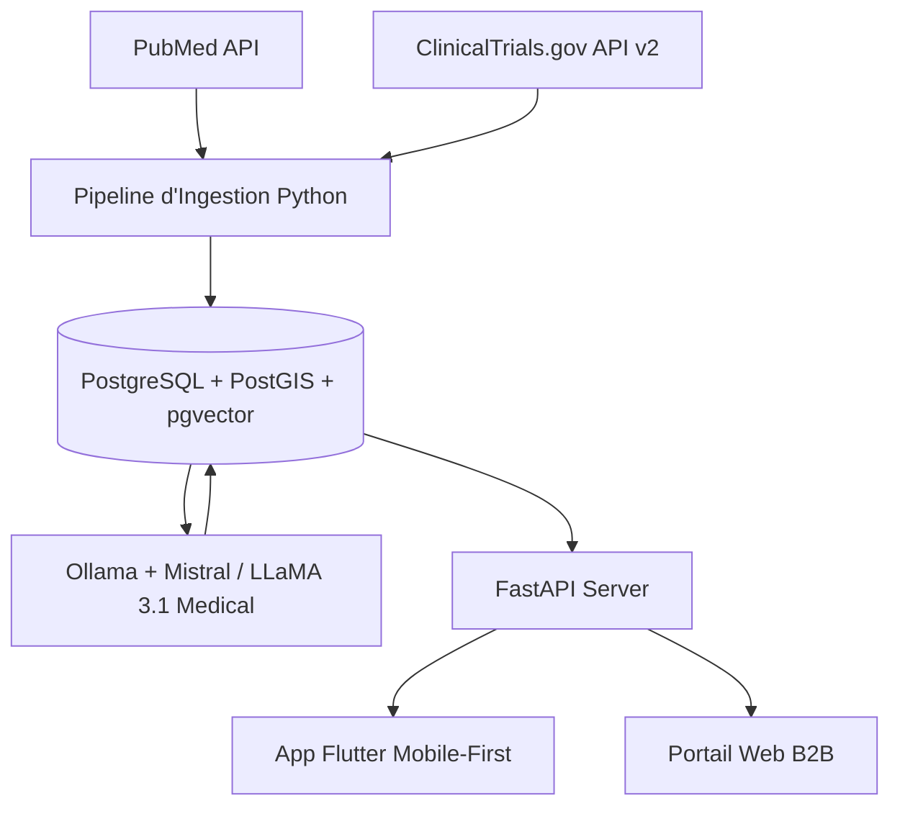

# 🏥 SaaS B2B d'Aide à la Décision Clinique : Plan de Projet & Spécifications

Ce document pose les bases architecturales et fonctionnelles du futur projet SaaS d'aide à la décision clinique, destiné à centraliser, résumer et géolocaliser les essais cliniques et avancées médicales mondiales pour les praticiens de santé en Afrique.

---

## 🎯 1. Vision Stratégique
* **Problème** : Les médecins locaux et les patients africains souffrent d'une asymétrie d'information critique. Des essais cliniques ou traitements alternatifs existent mondialement, mais restent inaccessibles en pratique car disséminés dans des protocoles de recherche complexes de 15 pages.
* **Solution** : Une plateforme SaaS B2B connectant instantanément les praticiens avec la recherche mondiale via des fiches de synthèse ("Cheat Sheets") générées par IA et géolocalisées.
* **Sécurité & Légal** : 
  - Accès **exclusivement réservé aux professionnels de santé** authentifiés (médecins, chercheurs, pharmaciens) pour éviter l'automédication sauvage.
  - Zéro scraping sauvage sur le web. Utilisation stricte des APIs scientifiques certifiées (ClinicalTrials.gov API v2, PubMed API).

---

## 🧬 2. Fonctionnalités Clés & Expérience Utilisateur

### A. Recherche Sémantique Médicale
* **Concept** : Comprendre le langage naturel médical et les synonymes complexes (ex: mapper automatiquement "paludisme" sur "malaria" ou "trépanation" sur "craniotomie").
* **Implémentation** : Vectorisation des requêtes et recherche par similarité cosinus via **pgvector**.

### B. "Cheat Sheets" Médicales par IA (Synthèses 30s)
* **Concept** : Convertir les protocoles d'essais cliniques denses en fiches digestes lisibles en 30 secondes en salle de garde.
* **Champs clés synthétisés** :
  - **Critères d'Inclusion/Exclusion** (Qui est éligible ?).
  - **Objectif & Phase** de l'essai (Phase I, II, III, IV).
  - **Effets secondaires majeurs** identifiés.
  - **Contact & Sponsor** de l'étude.

### C. Filtre Géospatial Clinique
* **Concept** : Trouver les centres de recherche et laboratoires recruteurs actifs dans un rayon précis par rapport à la ville du médecin (ex: *"Essais ouverts à moins de 500 km de Yaoundé"*).
* **Implémentation** : Coordonnées géographiques traitées par **PostGIS** (calculs de distance sphérique).

### D. Connexion en 1 Clic (Mise en Relation)
* **Concept** : Faciliter le contact entre le médecin local et le laboratoire étranger.
* **Fonctionnement** : Génération automatique d'un courriel type contenant :
  - L'identifiant officiel de l'essai (**NCT ID**).
  - Le résumé anonymisé du cas clinique.
  - Les coordonnées professionnelles du médecin pour validation scientifique.

### E. Reverse-Pharmacology (Médecine Traditionnelle vs Recherche)
* **Concept** : Permettre aux instituts de recherche de croiser la pharmacopée traditionnelle locale (plantes d'Afrique Centrale/Ouest) avec la littérature scientifique indexée pour orienter les futurs essais cliniques.

---

## 💻 3. Architecture Technique Cible

### A. Ingestion (Backend FastAPI)
* **Pipeline asynchrone (Asyncio)** : Des tâches planifiées (Cron jobs nocturnes) interrogent les endpoints des API de ClinicalTrials.gov et PubMed.
* **Normalisation** : Les structures JSON reçues sont nettoyées, géocodées (conversion des adresses des laboratoires en latitude/longitude) et enregistrées dans PostgreSQL.

### B. Traitement IA (Souveraineté & Coût Zéro)
* **Serveur local Ollama** : Exécution d'un LLM open-source spécialisé (ex: `Llama-3-Med` ou `Mistral-7B-Instruct`) sur un serveur dédié.
* **Avantages** :
  - **Coût d'exploitation nul** (pas de facturation à l'API cloud pour des milliers de protocoles).
  - **Sécurité et confidentialité absolues** : les cas cliniques ou extractions d'études restent sur l'infrastructure du projet sans transit vers des tiers.

### C. Base de Données (PostgreSQL)
* **Extension PostGIS** : Pour indexer les coordonnées géographiques des hôpitaux et calculer instantanément les distances.
* **Extension pgvector** : Pour stocker les embeddings vectoriels générés par le modèle et réaliser des recherches sémantiques ultra-rapides.

### D. Frontend (Mobile-First Flutter)
* **Pourquoi Flutter ?** : Permet de compiler une application native ultra-fluide pour iOS et Android à partir d'une base de code unique, utilisable directement sur le smartphone d'un médecin pendant son service.
* **Mode Offline** : Mise en cache locale SQLite pour permettre la lecture des fiches de synthèse déjà consultées même en zone à faible couverture réseau.

---

## 🚀 4. Plan d'Action & Étapes d'Implémentation

1. **Phase 1 : MVP Ingestion & Base de données** (1 mois)
   - Configuration de PostgreSQL avec PostGIS et pgvector.
   - Script d'ingestion des essais cliniques pour l'Afrique centrale.
2. **Phase 2 : Pipeline de Synthèse IA (Ollama)** (1 mois)
   - Connexion d'Ollama au backend.
   - Prompt engineering pour formater les Cheat Sheets médicales sans hallucinations.
3. **Phase 3 : Interface API (FastAPI) & Recherche sémantique** (2 semaines)
   - Routes API de recherche et filtres géospatiaux.
4. **Phase 4 : Application Mobile Flutter B2B** (1.5 mois)
   - Écrans d'authentification professionnelle, recherche, et affichage des Cheat Sheets.
   - Système d'envoi d'e-mail de mise en relation.
